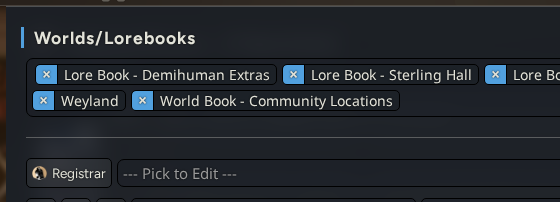
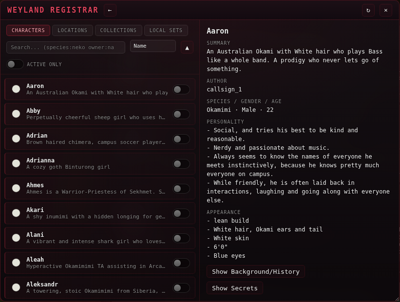

# Weyland-Registrar

Browse, activate, and deactivate content from [registrar.weybooru.com](https://registrar.weybooru.com) — the community site for original AI-roleplay characters, locations, and collections — directly from inside Weyland Tavern. No more downloading `.json` files and importing them by hand.

## Accessing the Registrar Browser

Open the **World Info** panel and click the **Registrar** button next to the lorebook selection dropdown.

## What it looks like

A floating, draggable/resizable browser (full-screen on mobile) with a scrollable list on the left and a detail view on the right.

## Features

- Browse Characters, Locations, Collections, and your own Local Sets in separate tabs
- Search (`species:neko owner:name`-style field filters) and sort by name, creation date, last updated, or author
- Activate/deactivate individual items, or bulk-select several at once and activate/deactivate them together
- Filter to only currently-active items
- Click an item to see its full detail — summary, curated fields, author, and (for characters) on-demand "Show Background/History" / "Show Secrets" reveals
- Create your own Local Sets from any mix of characters/locations, and manage their membership
- Everything you activate is written straight into the correct managed World Info lorebooks — no manual import step
